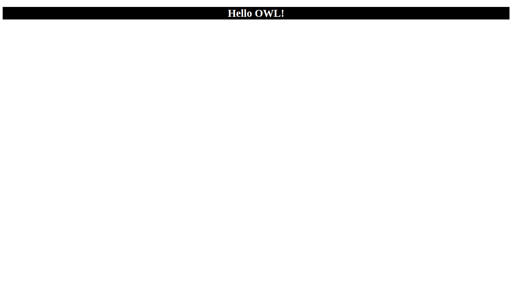

# OWL & Webpack: A Recipe for CSS-Powered Apps

This guide outlines setting up an Odoo OWL project with Webpack for CSS management, enabling styled OWL applications.

## Prerequisites & Tools
Node.js and npm (or yarn): From nodejs.org.

## Key npm packages:
- @odoo/owl (OWL framework)
- webpack
- webpack-cli
- css-loader
- html-webpack-plugin
- style-loader


## Setup Steps

### Project Initialization

Create Directory:
```
mkdir your-directory-name
cd your-directory-name
```

Initialize npm:
```
npm init -y
```
Install Dependencies:
```
npm install @odoo/owl bulma
npm install --save-dev webpack webpack-cli html-webpack-plugin style-loader css-loader
```

### CSS sytle

create a `style.css` in the project root with following conents.
```
.title {
    color: white;
    background-color: black;
    text-align: center;
}
```

### OWL Application (main.js)

Create `main.js` in the project root:
```
import { mount, Component, xml } from "@odoo/owl";
import 'bulma/css/bulma.css'

class Root extends Component {
    
    static template = xml`<h1 class="title">Hello OWL!</h1>`

}

mount(Root, document.body)
```
Imports OWL essentials and `style.css`. Defines a simple Main component and mounts it.

### Webpack Configuration

Create `webpack.config.js` in the project root:
```
const path = require('path');
const HtmlWebpackPlugin = require('html-webpack-plugin');

module.exports = {
    mode: 'development',
    entry: './main.js',
    output: {
        filename: 'main.js',
        path: path.resolve(__dirname, 'dist'),
        clean: true
    },
    module: {
        rules: [
          { test: /\.css$/i, use: ['style-loader', 'css-loader'] },
        ],
      },
    plugins: [
        new HtmlWebpackPlugin({ title: 'Webpack CSS OWL' }),
    ]
};
```
Core: Configures Webpack for development mode, sets ./main.js as the entry, outputs bundled main.js to a clean dist folder, and uses style-loader & css-loader for .css files. HtmlWebpackPlugin generates index.html with the script injected.

### Build and View

in termial write the following command and press enter.
```
webpack
```

Webpack bundles assets into the dist folder and HtmlWebpackPlugin creates dist/index.html. Styles are injected.

## View:
Open `dist/index.html` in a web browser to see something like the following image.


