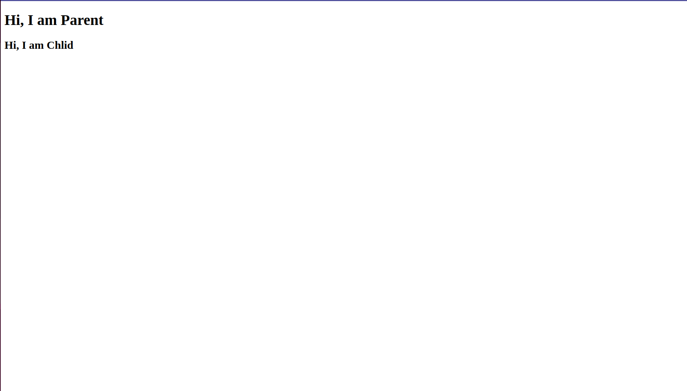

# Owl Creating and Using Sub Components

This guide outlines creating child Components in OWL.

## Prerequisites & Tools
Node.js and npm (or yarn): From nodejs.org.

## Key npm packages:
- @odoo/owl (OWL framework)
- webpack
- webpack-cli
- html-webpack-plugin

## Setup Steps

### Project Initialization

Create Directory:
```
mkdir your-directory-name
cd your-directory-name
```

Initialize npm:
```
npm init -y
```
Install Dependencies:
```
npm install @odoo/owl
npm install --save-dev webpack webpack-cli html-webpack-plugin
```

### OWL Application (main.js)

Create `main.js` in the project root:
```
import {App, Component, xml} from "@odoo/owl"

class Child extends Component {
    static template = xml`<h2>Hi, I am Chlid</h2>`
}

class Parent extends Component {
    static template = xml`<h1>Hi, I am Parent</h1>
                            <Child/>`
    static components = {Child}
}


class MainComponenet extends Component {
    static template = xml`<Parent/>`
    static components = {Parent}
}

const app = new App(MainComponenet)
app.mount(document.body)
```
This code imports OWL essentials, then defines two components named `Parent` and `Child`.

In OWL, components are class-based and must inherit from the `Component` class. The `Component` class has a few `static properties` that are needed to completely define a component. One of these is the `template` static property, which defines the component's structure in the DOM tree. Depending on your use case, you may need to define other static properties.

For instance, if you use a sub-component's tag within another component's template, you must define the `components` static property. This property expects an object containing the classes of any sub-components needed by the template. In this tutorial, we use the `<Child />` tag, which is not a native HTML tag. The definition for this tag comes from another OWL component. Therefore, if we don't mention the sub-component in the static `components` property, the renderer will not be able to find the definition for the `<Child />` tag and will likely result in an error.

### Webpack Configuration

Create `webpack.config.js` in the project root:
```
const path = require('path');
const HtmlWebpackPlugin = require('html-webpack-plugin');

module.exports = {
    mode: 'development',
    entry: './main.js',
    output: {
        filename: 'main.js',
        path: path.resolve(__dirname, 'dist'),
        clean: true
    },
    plugins: [
        new HtmlWebpackPlugin({ title: 'Tutorial 3 Sub component demo' }),
    ]
};
```
Core: Configures Webpack for development mode, sets ./main.js as the entry, outputs bundled main.js to a clean dist folder. HtmlWebpackPlugin generates index.html with the script injected.

### Build and View

in termial write the following command and press enter.
```
webpack
```

Webpack bundles assets into the dist folder and HtmlWebpackPlugin creates dist/index.html

## View:
Open `dist/index.html` in a web browser to see something like the following image.
